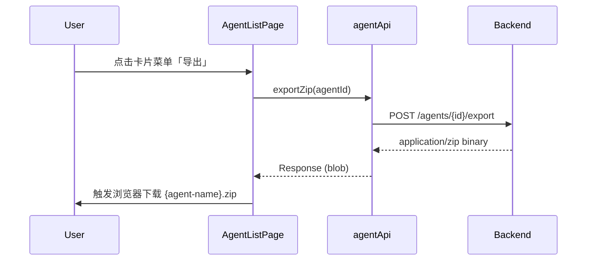
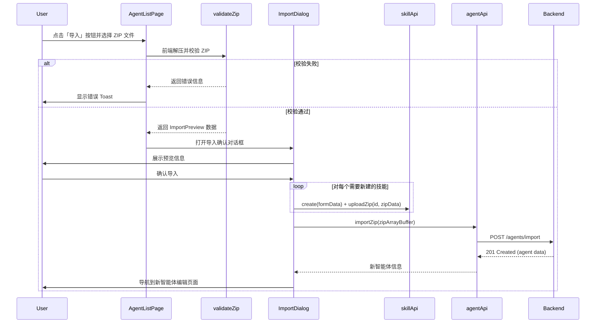
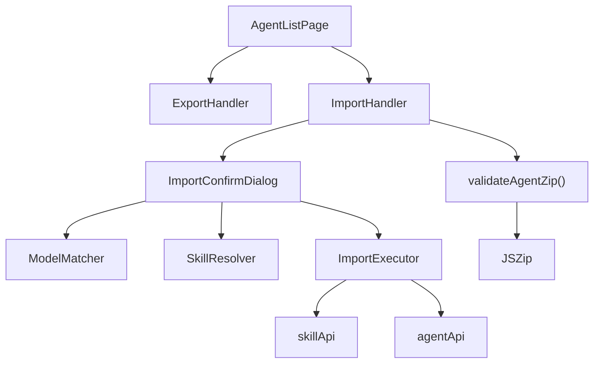

# Agent Import/Export

Feature Name: agent-import-export
Updated: 2026-04-26

## Description

为 CodeTeam 平台的智能体管理模块实现导入导出功能。导出将智能体的完整配置（基本信息、模型引用、规则文件、MCP 服务器配置、技能引用及技能文件）打包为 ZIP 文件；导入则在前端完成 ZIP 解析、格式校验、模型匹配、技能冲突检测，经用户确认后调用后端 API 完成创建。

## Architecture

### 导出流程



### 导入流程



### 模块关系



## Components and Interfaces

### 1. manifest.json Schema

```typescript
// manifest 版本常量
const SUPPORTED_MANIFEST_VERSIONS = ['1.0'] as const;

interface AgentManifest {
  version: '1.0';
  agent: {
    name: string;
    icon: string;
    description: string;
    author: string;
    website: string;
    system_prompt: string;
  };
  model: {
    id: string;
    name: string;
  } | null;
  rules: Array<{
    filename: string;
    sort_order: number;
  }>;
  mcp_servers: Array<{
    name: string;
    transport_type: string;
    config: Record<string, unknown>;
    tool_filter: string;
    sort_order: number;
  }>;
  skill_refs: Array<{
    skill_name: string;
    sort_order: number;
  }>;
}
```

### 2. ZIP 校验模块 -- validateAgentZip()

```typescript
interface ValidationError {
  code: 'INVALID_ZIP' | 'MISSING_MANIFEST' | 'INVALID_MANIFEST_JSON'
    | 'UNSUPPORTED_VERSION' | 'MISSING_RULE_FILE' | 'MISSING_SKILL_DIR';
  message: string;
  details?: string;
}

interface ValidationResult {
  success: false;
  error: ValidationError;
} | {
  success: true;
  manifest: AgentManifest;
  ruleContents: Map<string, string>;       // filename -> content
  skillFiles: Map<string, ArrayBuffer>;     // skillName -> zip ArrayBuffer
  rawZipBuffer: ArrayBuffer;                // 原始 ZIP 用于后端导入
}

async function validateAgentZip(file: File): Promise<ValidationResult>;
```

**校验步骤（按顺序执行）：**

1. 使用 JSZip 解压文件，失败则返回 `INVALID_ZIP` 错误
2. 检查根目录是否存在 `manifest.json`，不存在返回 `MISSING_MANIFEST`
3. 解析 manifest.json，失败返回 `INVALID_MANIFEST_JSON`
4. 校验 `version` 字段是否在 `SUPPORTED_MANIFEST_VERSIONS` 中
5. 遍历 `rules` 列表，检查每个 filename 对应的 `rules/{filename}` 是否存在
6. 遍历 `skill_refs` 列表，检查每个 skill_name 对应的 `skills/{skill_name}/` 目录是否存在
7. 校验通过后，提取规则文件内容和技能文件（为每个技能重新打包为独立 ZIP）

### 3. 导入预览数据 -- ImportPreview

```typescript
type ModelMatchStatus =
  | { type: 'matched'; model: LLMConfig }
  | { type: 'not_found'; originalName: string; originalId: string }
  | { type: 'no_model' };

type SkillMatchStatus =
  | { type: 'existing'; skillName: string }
  | { type: 'new'; skillName: string };

interface ImportPreview {
  agent: AgentManifest['agent'];
  modelStatus: ModelMatchStatus;
  rules: AgentManifest['rules'];
  mcpServers: AgentManifest['mcp_servers'];
  skills: SkillMatchStatus[];
  ruleContents: Map<string, string>;
  skillFiles: Map<string, ArrayBuffer>;
  rawZipBuffer: ArrayBuffer;
}
```

### 4. 预览构建函数 -- buildImportPreview()

```typescript
async function buildImportPreview(
  validationResult: Extract<ValidationResult, { success: true }>,
  localModels: LLMConfig[],
  localSkills: Skill[]
): Promise<ImportPreview>;
```

**逻辑：**
- 模型匹配：先按 ID 匹配，再按 name 匹配，均未匹配则标记为 `not_found`
- 技能匹配：按 skill_name 检查本地 skills 列表，存在则标记 `existing`，否则 `new`

### 5. 导入确认对话框 -- ImportConfirmDialog

```typescript
interface ImportConfirmDialogProps {
  open: boolean;
  onClose: () => void;
  preview: ImportPreview;
  models: LLMConfig[];
  onConfirm: (overrides: ImportOverrides) => void;
  importing: boolean;
}

interface ImportOverrides {
  modelId: string | undefined;  // 用户选择的替代模型 ID（或匹配到的模型 ID）
}
```

**对话框 UI 分区：**

| 区域 | 内容 |
|------|------|
| 基本信息 | 图标 + 名称 + 描述 + 作者 |
| 模型 | 匹配成功显示模型名称；匹配失败显示警告 + 下拉选择框 |
| 规则 | 文件列表，显示文件名和数量统计 |
| MCP 服务器 | 服务器列表，显示名称和传输类型 |
| 技能 | 列表，每项标注「使用现有技能」或「新建技能」 |
| 操作按钮 | 「取消」和「确认导入」（模型未选择时禁用） |

### 6. 导入执行函数 -- executeImport()

```typescript
async function executeImport(
  preview: ImportPreview,
  overrides: ImportOverrides
): Promise<{ agentId: string }>;
```

**执行步骤：**

1. **创建新技能**：对每个 `type: 'new'` 的技能：
   - 调用 `skillApi.create(formData)` 创建技能（name + description）
   - 调用 `skillApi.uploadZip(skillId, zipArrayBuffer)` 上传技能文件
2. **导入智能体**：调用 `agentApi.importZip(rawZipBuffer)` 将原始 ZIP 发送到后端
3. **返回**新创建的 agent ID

> 注意：后端 `POST /agents/import` 接口负责解析 ZIP 包并创建 Agent 及其关联的 Rules、MCP Servers、SkillRefs。前端在调用前需确保所有 skill 均已存在于技能库中。模型 ID 的替换由前端在调用后端 API 之前修改 manifest.json 中的 model 信息来实现，然后重新打包 ZIP。

### 7. AgentListPage 修改

**新增导出功能（卡片菜单）：**

在每个智能体卡片的操作菜单中添加「导出」选项，点击触发下载流程：

```typescript
const handleExport = async (agentId: string, agentName: string) => {
  try {
    const response = await agentApi.exportZip(agentId);
    const blob = await response.blob();
    const url = URL.createObjectURL(blob);
    const a = document.createElement('a');
    a.href = url;
    a.download = `${agentName}.zip`;
    a.click();
    URL.revokeObjectURL(url);
  } catch (err) {
    // 显示错误 toast
  }
};
```

**新增导入功能（顶部按钮）：**

在页面顶部操作栏，与「新建智能体」按钮并列放置「导入」按钮：

```tsx
<label className="flex items-center gap-1 px-3 py-1 border rounded-md text-sm cursor-pointer hover:bg-accent">
  <Upload className="w-4 h-4" /> 导入
  <input type="file" accept=".zip" onChange={handleImportFile} className="hidden" />
</label>
```

## Data Models

### manifest.json 示例

```json
{
  "version": "1.0",
  "agent": {
    "name": "Code Review Assistant",
    "icon": "CR",
    "description": "A professional code review agent",
    "author": "CodeTeam",
    "website": "https://codeteam.ai",
    "system_prompt": "You are a professional code reviewer..."
  },
  "model": {
    "id": "abc123",
    "name": "GPT-4o"
  },
  "rules": [
    { "filename": "code-style.md", "sort_order": 0 },
    { "filename": "review-checklist.md", "sort_order": 1 }
  ],
  "mcp_servers": [
    {
      "name": "github-mcp",
      "transport_type": "stdio",
      "config": {
        "command": "npx",
        "args": ["-y", "@modelcontextprotocol/server-github"],
        "env": {}
      },
      "tool_filter": "*",
      "sort_order": 0
    }
  ],
  "skill_refs": [
    { "skill_name": "code-review", "sort_order": 0 },
    { "skill_name": "testing-guide", "sort_order": 1 }
  ]
}
```

### ZIP 包文件结构示例

```
code-review-assistant.zip
├── manifest.json
├── rules/
│   ├── code-style.md
│   └── review-checklist.md
└── skills/
    ├── code-review/
    │   ├── SKILL.md
    │   └── templates/
    │       └── review-template.md
    └── testing-guide/
        └── SKILL.md
```

## Correctness Properties

### 不变量

1. **manifest.json 完整性**：导出的 ZIP 中 manifest.json 必须与 ZIP 内实际文件一一对应
2. **技能唯一性**：导入后本地技能库中不会出现同名技能冲突
3. **模型引用有效性**：导入后智能体的 model_id 必须指向一个有效的本地 LLMConfig，或者为空
4. **原子性（尽力保证）**：如果后端 importZip 调用失败，前端已创建的新技能不会自动回滚，但会提示用户

### 约束

1. manifest.json 的 version 字段必须在 `SUPPORTED_MANIFEST_VERSIONS` 范围内
2. 前端 ZIP 解析使用 JSZip（项目已有依赖），不引入新依赖
3. 导出由后端完成打包，前端仅触发下载
4. 导入时前端负责校验和预览，后端负责实际创建

## Error Handling

| 场景 | 错误类型 | 处理方式 |
|------|----------|----------|
| ZIP 文件无法解压 | INVALID_ZIP | Toast 提示「文件格式无效」 |
| 缺少 manifest.json | MISSING_MANIFEST | Toast 提示具体缺失文件 |
| manifest.json 解析失败 | INVALID_MANIFEST_JSON | Toast 提示 JSON 格式错误 |
| 不支持的版本号 | UNSUPPORTED_VERSION | Toast 提示版本不兼容 |
| 规则文件缺失 | MISSING_RULE_FILE | Toast 提示缺失的文件名 |
| 技能目录缺失 | MISSING_SKILL_DIR | Toast 提示缺失的技能名 |
| 模型匹配失败 | 业务逻辑 | 对话框内显示警告 + 手动选择 |
| 技能创建失败 | API 错误 | 对话框内显示错误 + 中断导入 |
| 后端导入 API 失败 | API 错误 | 对话框内显示错误 + 提示手动清理技能 |
| 导出 API 失败 | API 错误 | Toast 提示导出失败 |

## Test Strategy

### 单元测试

1. **validateAgentZip**
   - 输入有效 ZIP 返回 success
   - 输入非 ZIP 文件返回 INVALID_ZIP
   - 缺少 manifest.json 返回 MISSING_MANIFEST
   - manifest.json 格式错误返回 INVALID_MANIFEST_JSON
   - 不支持的版本返回 UNSUPPORTED_VERSION
   - 规则文件缺失返回 MISSING_RULE_FILE
   - 技能目录缺失返回 MISSING_SKILL_DIR

2. **buildImportPreview**
   - 模型 ID 精确匹配
   - 模型 name 匹配（ID 不匹配时）
   - 模型完全不匹配
   - model 为 null 时返回 no_model
   - 技能存在时标记 existing
   - 技能不存在时标记 new

3. **executeImport**
   - 无新技能时直接调用 importZip
   - 有新技能时先创建技能再导入
   - 技能创建失败时抛出错误

### 集成测试

1. 完整的导出-导入往返测试：创建智能体 -> 导出 -> 导入 -> 验证配置一致
2. 模型替代选择流程：导入包含不存在模型的 ZIP -> 选择替代模型 -> 验证关联
3. 技能冲突测试：导入包含已存在技能的 ZIP -> 验证使用现有技能

## References

[^1]: (src/api/client.ts) - [API 客户端定义](../../packages/frontend/src/api/client.ts)，agentApi.exportZip / importZip 在此定义
[^2]: (src/api/openapi3.json) - [OpenAPI 规范](../../packages/frontend/src/api/openapi3.json)，/agents/import 和 /agents/{id}/export 端点定义
[^3]: (src/types/index.ts) - [类型定义](../../packages/frontend/src/types/index.ts)，Agent, AgentRule, AgentMCPServer, AgentSkillRef, Skill, LLMConfig 等接口
[^4]: (src/pages/agents/AgentListPage.tsx) - [智能体列表页面](../../packages/frontend/src/pages/agents/AgentListPage.tsx)，导入按钮和导出菜单的入口
[^5]: (src/pages/agents/AgentEditPage.tsx) - [智能体编辑页面](../../packages/frontend/src/pages/agents/AgentEditPage.tsx)
[^6]: (src/components/editor/FileTreeEditor.tsx) - [文件树编辑器](../../packages/frontend/src/components/editor/FileTreeEditor.tsx)，packToZip 工具函数
[^7]: (src/pages/skills/SkillDetailPage.tsx) - [技能详情页](../../packages/frontend/src/pages/skills/SkillDetailPage.tsx)，已实现的 ZIP 上传/下载参考实现
